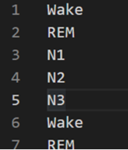

# 2021 Sleep AI Challenge

 

## Description
```
본 Repository는 2021 Sleep AI Challenge를 위한 페이지입니다.

수면다원검사는 대상자가 수면을 취하며 뇌파, 심전도, 호흡 등의 생체 신호를 측정하는 검사입니다.
수면기사 또는 수면전문의는 측정된 여러 신호들을 종합적으로 분석해 수면단계 분류, 이상 호흡 검출, 움직임 및 각성 검출 등을 판독합니다
이는 수면무호흡증, 기면병, 렘수면 장애 등 수면과 관련된 여러 질환을 진단하는 기반이 됩니다. 
```


## Data
```
- Data : 수면다원검사 결과 이미지 데이터 : 각 환자의 수면다원검사 결과를 이미지로 변환한 데이터 
- 이미지에는 아래 그림의 순서대로 신호가 포함되어 있음 : x축 가속도, y축 가속도 .............. 등 <수정>
- 30초 단위 데이터가 1장의 이미지로 변환 됨
- 환자는 평균 731.4장의 이미지를 보유하고 있음 (약 6시간)
- 데이터의 시간 순서는 이미지명으로 정렬되어 있음 : 예시 > 환자코드_0001.png 환자코드_0002.png, ...
- 검사 초기 일부는 수면이 시작되지 않아 레이블이 없음 : 예시 > 환자-1은 0004.png 부터 label이 존재
- Train/Validation Dataset : 800건(명), Label 공개  // Test Dataset : 200건(명), Label 비공개
- 
```
- Image Sample : <자료 받아서 수정>
 이미지
Metadata for signal
 이미지
 
- Label Sample : 

trainset-for_user.csv

Columns : ['환자 코드', '이미지 번호', '레이블']

 

testset-for_user.csv

Columns : ['환자 코드', '이미지 번호']
Class : 5개 클래스, ['Wake', 'N1', 'N2', 'N3', 'REM']

 


## Task

```
- Data : 수면다원검사 결과 이미지 데이터
- Task : 수면 단계 분류(Multi-Label Classification)
- Evalutation Metric : F-1 Macro

```

## 결과 제출 방법
```
1. 참가자는 Train/Validation Dataset을 기반으로 모델의 학습/검증을 수행합니다.
2. 참가자는 학습된 모델을 기반으로 Test Dataset에 대한 결과를 .csv file로 저장합니다.
  - Result Sample 참고
  - 결과의 정렬은 제공되는 testset-for_user.csv의 순서와 동일해야합니다.
 3. 참가자는 생성된 Result.csv file을 MAIC 플랫폼에 Submit합니다.
```

Result sample

Columns : ['레이블']



## 공지 사항
***!!!!!!!!!!!!!필독!!!!!!!!!!!!!!***
```
1. 이 공지사항을 숙지하지 않아 발생하는 모든 문제는 참가자에게 있음을 알립니다.
2. 
컨테이너 내 폴더 설명
- /[폴더명 미정] : read only 폴더
- /[폴더명 미정] :  read/write 폴더
1. 참가자는 각 문제별로 데이터를 로드하기 위해 적절한 path를 하단에 입력해야합니다. (datasets/각 문제 폴더)
2. 참가자는 모델의 결과 파일(Ex> prediction.txt)을 write가 가능한 폴더에 저장되도록 적절 한 path를 입력해야합니다. (tf/notebooks)
3. 명시된 폴더 외에는 세션/컨테이너 등 재시작시 삭제될 수 있으니 참가자는 적절한 폴더에 Source code와 결과 파일 등을 저장해야합니다.
```

## Q&A
```
공지사항 확인 및 Q&A는 아래 주소를 활용하시기 바랍니다.

URL 추가 (플랫폼에 Q&A 게시판 있는지 확인)
```
