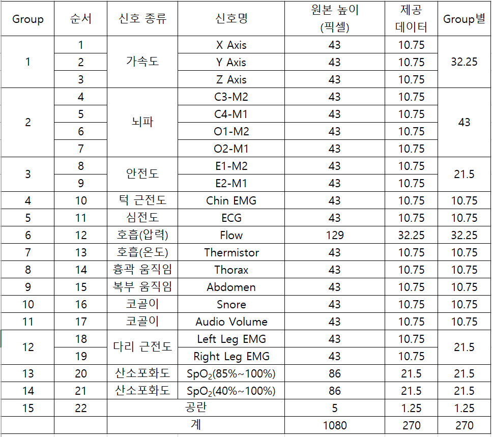
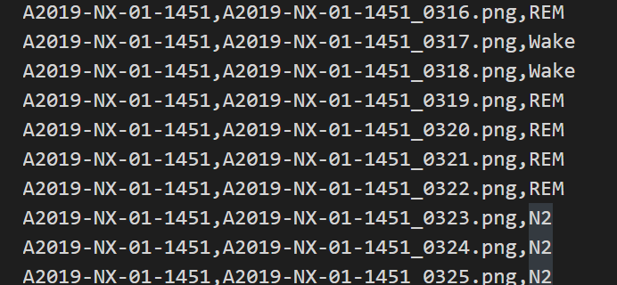
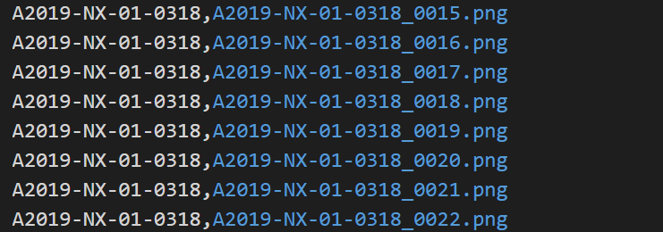
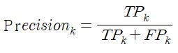
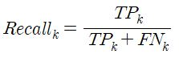
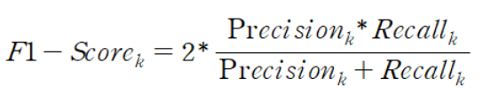
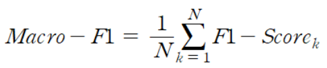
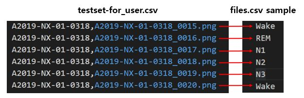
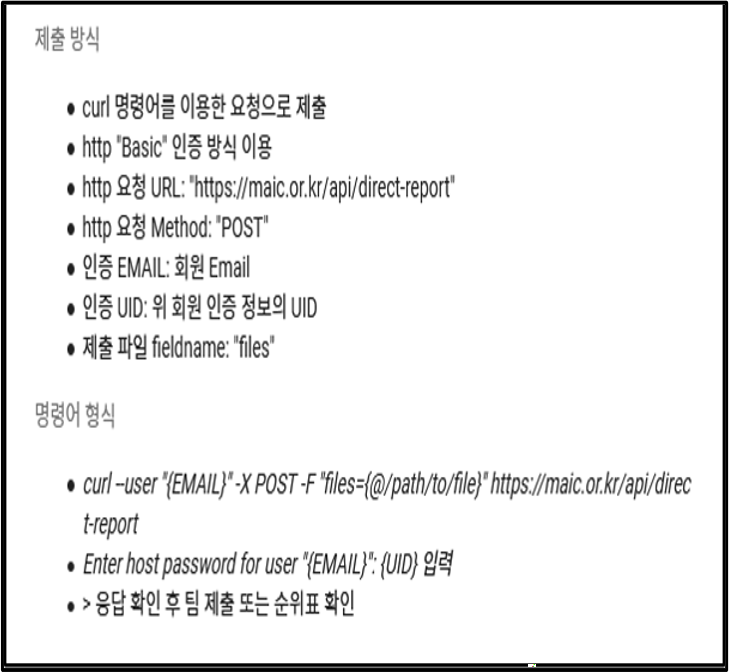
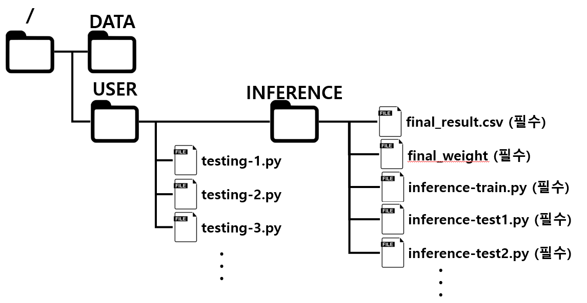

# 2021 Sleep AI Challenge
 


## Overview
```
본 Repository는 2021 Sleep AI Challenge를 위한 페이지입니다.

- 수면 다원 검사
수면다원검사는 대상자가 수면을 취하며 뇌파, 심전도, 호흡 등의 생체 신호를 측정하는 검사입니다.
수면기사 또는 수면전문의는 측정된 여러 신호들을 종합적으로 분석해 수면단계 분류, 이상 호흡 검출, 움직임 및 각성 검출 등을 판독합니다
이는 수면무호흡증, 기면병, 렘수면 장애 등 수면과 관련된 여러 질환을 진단하는 기반이 됩니다. 

- 문제 정의 : 수면다원검사 이미지 데이터를 기반으로 각 이미지의 수면단계(Wake, N1, N2, N3, REM) 분류
```

## Data
```
- Data : 수면다원검사 결과 이미지 데이터
- 이미지에는 아래의 순서대로(상단부터 하단으로) 신호가 포함되어 있음 
 └ X Axis, Y Axis, Z Axis, C3-M2, C4-M1, O1-M2, O2-M1, E1-M2, E2-M1, Chin EMG, ECG, Flow, Thermistor, Thorax, Abdomen, Snore, Audio Volume, Left Leg EMG, Right Leg EMG, SpO2(85%~100%), SpO2(40~100%)
 └ 각 신호가 차지하는 높이(Pixel) 아래 표 참고
 └ 원본 이미지는 1080이나 270으로 Resize 되어 제공됨, 이에 따라 높이(Pixel)는 다소 오차가 있을 수 있음
 └ 각 그룹 내의 Signal은 서로의 영역을 침범 할 수 있음, 다른 그룹의 Signal은 서로의 영역을 침범 할 수 없음
 ** 참고 : Sample_crop.zip file - 제시된 pixel을 기반으로 각 Signal, Group 별로 Crop
- 1건의 검사결과는 약 6시간에 대한 검사 결과이며, 30초 단위의 데이터가 1장의 이미지로 변환 됨.
- 각 검사 결과는 평균 731.4장의 이미지를 보유하고 있음 (약 6시간)
- 데이터의 시간 순서는 이미지명으로 정렬되어 있음 : 예시 > 검사결과 코드_0001.png 검사결과 코드_0002.png, ...
- 각 이미지는 순서에 따라 연속적인 데이터임
- 검사 초기 일부는 수면이 시작되지 않아 레이블이 없음 : 예시 > 검사결과-1은 0004.png 부터 label이 존재
- Train/Validation Dataset : 800건(명), Label 공개  // Test Dataset : 200건(명), Label 비공개
- 
```

- Image Sample : 

Sample Image data (제공되는 데이터에는 워터마크 없음)

아래 샘플데이터 4장은 특정 시점을 기준으로 0-30초, 30-60초, 60초-90초, 90-120초의 검사결과를 나타냄

  

  

 
 
 - Label Sample : 
 
trainset-for_user.csv, Columns : ['검사결과 코드', '이미지 번호', '레이블']

 

testset-for_user.csv, Columns : ['검사결과 코드', '이미지 번호'], Class : 5개 클래스, ['Wake', 'N1', 'N2', 'N3', 'REM']


 


## Task
```
- Data : 수면다원검사 결과 이미지 데이터
- Task : 수면 단계 분류(Multi-Label Classification)
- Evalutation Metric : F-1 Macro
```
Macro-F1

   

 

 

## 결과 제출 방법
```

1. 참가자는 Train/Validation Dataset을 기반으로 모델의 학습/검증을 수행합니다.
2. 참가자는 학습된 모델을 기반으로 Test Dataset에 대한 결과를 'files.csv' 로 저장합니다.
  - 결과의 정렬은 제공되는 testset-for_user.csv의 순서와 동일해야합니다. <결과 파일 예시> 참고.
3. 참가자는 생성된 'files.csv' file을 MAIC 플랫폼에 Submit합니다. <결과 제출 방법> 참고
4. 리더보드에서 제출한 모델의 성능/순위를 확인합니다.
5. 참가자는 대회 마감 전 모델 검증을 위해 다음 사항을 반드시 이행해야 합니다.
 - 제시된 <디렉토리 구조> 를 기반으로  참고
  └ / : Docker Container에 Mount 되는 기본 폴더
  └ /DATA : 데이터셋이 위치한 폴더 (Read-only)
  └ /USER : 참가자가 Code 등을 저장, 원하는 형태로 사용 가능한 폴더
  └ /USER/INFERENCE : 최종 결과 제출을 위한 모든 file을 저장하기 위한 폴더
 - MAIC 플랫폼에 제출한 결과 중 최고점을 받은 .csv file을 'final_result.csv' 이름으로 INFERENCE 폴더에 Copy
 - 최고점을 받은 모델의 검증을 위해 필요한 모든 소스코드(main.py, model.py, loader.py, train.py 등) 및 학습된 모델의 가중치 파일을 'final_weight'(.pth 등)로 INFERENCE 폴더에 Copy
 - inference-train.py 코드 작성
  └ Train/Validation Dataset을 기반으로 학습하여 최고점을 받은 모델과 비슷한 성능을 보이는 모델을 'infer.pth' 등으로 저장하도록 해야함 (학습된 모델(weight)의 확장자명은 고정 아님)
 - inference-test1.py 코드 작성
  └ 'infer.pth'을 로드하고, INFERENCE 폴더에 'inference_result1.csv'로 testing 결과를 저장하도록 해야함
 - inference-test2.py 코드 작성
  └ 최고점을 받은 모델을 로드하고, INFERENCE 폴더에 'inference_result2.csv'로 testing 결과를 저장하도록 해야함
 
  *** 참가자는 반드시 재현성을 보장해야함, 재현 불가시 평가에서 탈락 할 수 있음 ***
 ```

<결과 파일 예시>
```
!!!!!!!! 중요 !!!!!!! 
Testset csv의 전체 라인은 138,925 입니다.
라인 수가 이보다 많거나 적을시 채점이 정상적으로 이루어지지 않습니다.
!!!!!!!!!!!!!!!!!!!!!
```


<결과 제출 방법>

중요!!!!! 아래 curl 예시 중 이메일 주소는 MAIC 홈페이지 가입 시 입력한 메일,UID는 부여받은 값을 입력해야합니다.
<예시> 
1. curl 명령어 입력 : curl --user "test@test.com" -X POST -F "files=@/USER/files.csv" https://maic.or.kr/api/direct-report
2. UID 입력 : 123456789b-fpd
3. password 입력 : password1234
4. 제출 결과 확인 
 - 제출 성공 시 메세지 확인 : { "message": "{팀이름}팀 {이용자명}님 제출이 완료되었습니다. 남은 일일 제출 횟수는 {남은 제출횟수}회/{총 허용된 일일 제출횟수}회 입니다." }
 - 팀별 일일 제출 가능 횟수는 500회 (제출 성공 기준)
 
 

<EMAIL 및 UID> 확인 방법 >


<디렉토리 구조>



## 평가 방법
```
1. 정량 평가 : 정량적인 평가를 위해 F-1 Macro Metric을 기반으로 모델의 정확도를 평가합니다.
 - 이를 기반으로 상위권 팀에 대해 2차 정성 평가를 진행합니다.
 
2. 정성 평가 : 아래 내용을 포함한 개발 문서를 ppt 형태로 제출하게 되며, 이를 기반으로 발표 평가가 진행됩니다.
[Title] 제목, 팀명, 팀원 전체 목록
[Introduction] 적용한 기술 개요
[Methods] 전처리, 모델 블록도, 최적화 방법
[Results] 결과
등...
```

## 참고
```
홈페이지 : https://maic.or.kr/
```

## Q&A
```
Homepage. http://maic.or.kr
E-mail : sleep.aichallenge@gmail.com
Phone : 070-7006-9191
```

## 이 공지사항을 숙지하지 않아 발생하는 모든 불이익은 참가자에게 있음을 알립니다. ##
